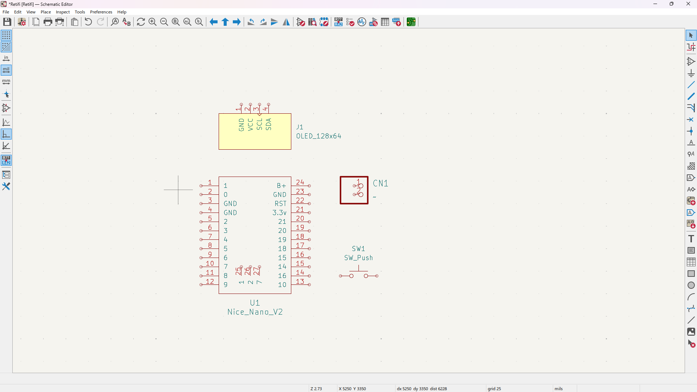
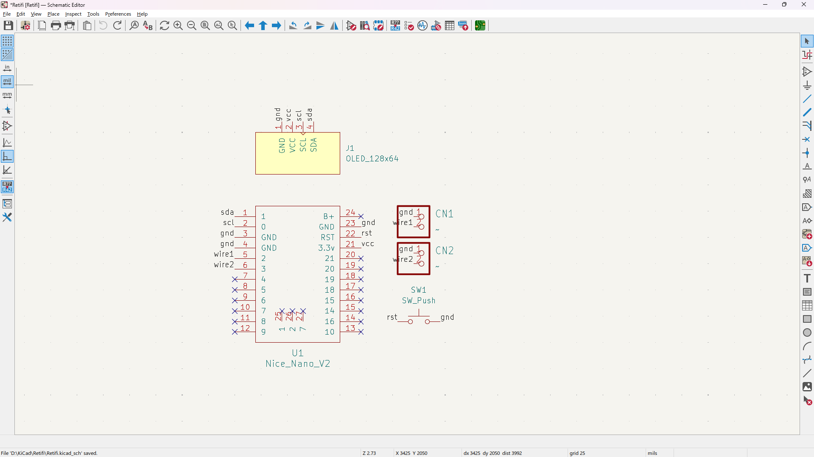
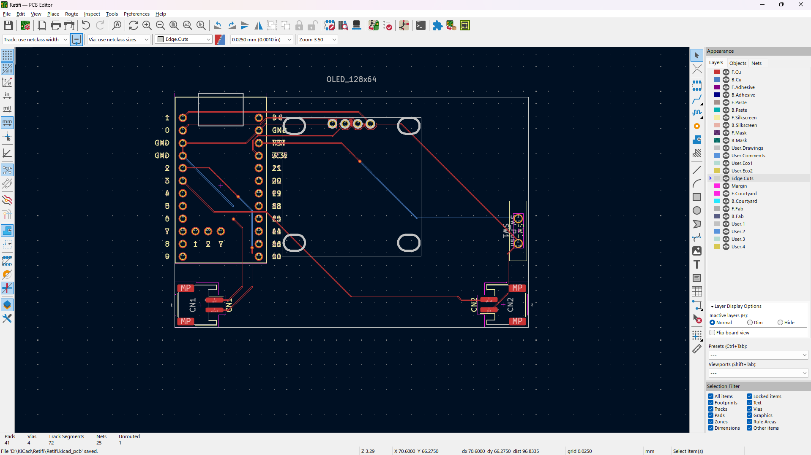

- [Journal](#journal)
  - [28/07/2025](#28072025)
  - [29/07/2025](#29072025)
  - [30/07/2025](#30072025)

# Journal

> [!NOTE]\
> Total time spent: **27h**

## 28/07/2025

Research on microcontrollers. Honestly the nice nano (i.e., a random compatible version on aliexpress) is goated - USB C, built in LiPo charging, a lotta GPIO, and uh probably some other stuff I can't remember rn.

Took a bunch of time but found these, they look good https://www.aliexpress.com/item/1005008498887267.html.

Omg ok so aparent JST PH and JST SH and all that is different ;-;.

Luckily this does work - https://www.aliexpress.com/item/1005008864177105.html?spm=a2g0o.cart.0.0.2f3538daCbb432.

Unconnected schematic: 

> [!NOTE]\
> Total time spent: **9h**

## 29/07/2025

https://www.aliexpress.com/item/1005006448352168.html

NEVERMIND THE DELIVERY IS SETPTEMBER 30 OMG.

We using PiHut for this one https://thepihut.com/products/150mah-3-7v-lipo-battery. 

Finished schematic wiring.

Wired up PCB.

Ok so battery from PiHut so the shipping isn't atrociouslly (this spelling is definitely wrong) long, same for magnets.

> [!NOTE]\
> Total time spent: **8h**

## 30/07/2025

Had to redo case since PCB JST was moved from bottom to l / r because thats easier to lay down with.

Ok Fusion has a thread feature that saves me -

M12x0.75.

Ok case finished (rip timeline):

Now to do the README, etc.

> [!NOTE]\
> Total time spent: **10h**