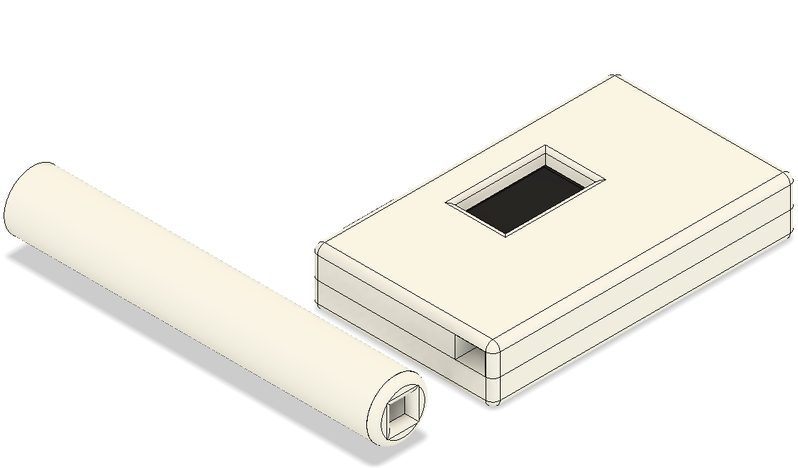
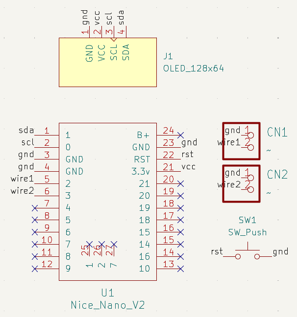
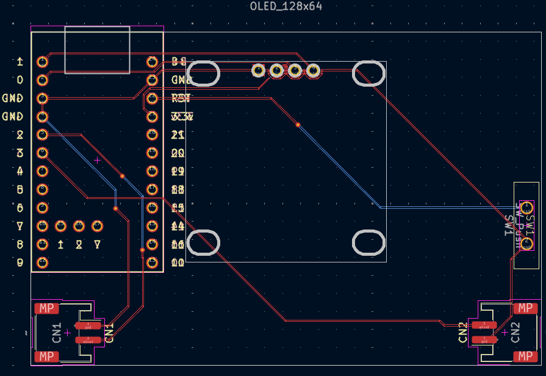

# Retini

- [Retini](#retini)
  - [Journal](#journal)
  - [PCB](#pcb)
    - [Schematic](#schematic)
    - [PCB Design](#pcb-design)
  - [BOM](#bom)

A simple reaction time tester consisting of a main module, and two handheld parts (with a push-button each), and a lil screen (the blank area will be covered by various stickers from different Hackclub YSWSs I have participate in - mainly Sprig lol).

I made this because I compete in a competition called F1 in Schools (although its now been rebranded to STEM Racing, supported by F1), and as part of the competition our reaction times play a big role when launching the miniature F1 in Schools car down the track (side note you should totally check us out, we won the uk national finals last year in dev class, and are competing this year after exams - https://instagram.com/warp_racing_ and https://warp-racing.com).

Also sorry for this being a tad rushed with the images etc, I just lost a bunch of time because of GitHub Codespace being a pain ()

## Journal

Can be found in [`JOURNAL.md`](JOURNAL.md).

> [!NOTE]\
> Total time spent: **27h**

## PCB

### Schematic

### PCB Design

## BOM

In USD, $62.52.

 Click to open (closed by default to save space lol)

| Component                | Description      | Notes                                                                                | Quantity | Price      | Shipping             | Provider               | Link                                                                                  |
| ------------------------ | ---------------- | ------------------------------------------------------------------------------------ | -------- | ---------- | -------------------- | ---------------------- | ------------------------------------------------------------------------------------- |
| Headers                  |                  | For screen because it doesn’t specify coming with some and I am taking zilch chances | 1        | £1.08      |                      | AliExpress             | [Link](https://www.aliexpress.com/item/4000988113226.html)                            |
| JST PH 2.00mm            | PH 2.00mm        | To connect the buttons to the PCB                                                    | 1        | £2.25      |                      |                        | [Link](https://www.aliexpress.com/item/1005007691949301.html)                         |
| Momentary Push Button    | Red 5PCS         | The actual button                                                                    | 1        | £3.23      |                      |                        | [Link](https://www.aliexpress.com/item/1005008498887267.html)                         |
| Heat Shrink Tube         | Mixed size       | Heat around the joint for the button to the switch                                   | 1        | £1.35      |                      |                        | [Link](https://www.aliexpress.com/item/1005008146302901.html)                         |
| Slide Switch             | k014a004-G3      | Switching it up here, eh? Lol ok that’s enough bad jokes for a day ;-;               | 1        | £2.09      |                      |                        | [Link](https://www.aliexpress.com/item/1005008904067609.html)                         |
| Nice nano                | But cheaaaper    | Teeheehee                                                                            | 1        | £2.21      |                      |                        | [Link](https://www.aliexpress.com/item/1005007383270623.html)                         |
| OLED                     | 2.42 I2C         |                                                                                      | 1        | £9.79      |                      |                        | [Link](https://www.aliexpress.com/item/1005008741364067.html)                         |
| Micro JST                | Male 5 Pcs 100mm | [Adafruit Guide](https://learn.adafruit.com/on-slash-off-switches/overview)          | 1        | £0.50      | £1.97                |                        | [Link](https://www.aliexpress.com/item/1005008864177105.html)                         |
| Micro JST                | Male 5 Pcs 100mm | [Adafruit Guide](https://learn.adafruit.com/on-slash-off-switches/overview)          | 1        | £0.34      | £1.97                |                        | [Link](https://www.aliexpress.com/item/1005008864177105.html)                         |
| Push Button              | 6x6x6mm          | For the reset function                                                               | 1        | £0.74      | £2.16                |                        | [Link](https://www.aliexpress.com/item/4001224103835.html)                            |
| **Total (AliExpress)**   |                  |                                                                                      |          | **£29.68** | Included on ze left! |                        |                                                                                       |
|                          |                  |                                                                                      |          |            |                      |                        |                                                                                       |
| 150mAh 3.7V LiPo Battery |                  | Couldn’t find any shipping sooner from AliExpress.                                   | 1        | £4.50      | £3.90                | PiHut                  | [Link](https://thepihut.com/products/150mah-3-7v-lipo-battery?variant=42388690993347) |
| **Total (PiHut)**        |                  |                                                                                      |          | **£8.40**  |                      |                        |                                                                                       |
|                          |                  |                                                                                      |          |            |                      |                        |                                                                                       |
| Comus Neodynium Magnet   | 3 by 4mm         | Again, AliExpress shipping is atrocious on this front.                               | 1        | £2.18      | £3.30 + £1.10 (VAT)  | Rapid Electronics (UK) | [Link](https://www.rapidonline.com/comus-m1219-3-neodynium-disc-magnet-78-1068)       |
|                          |                  |                                                                                      |          | **£6.58**  |                      |                        |                                                                                       |
|                          |                  |                                                                                      |          |            |                      |                        |                                                                                       |
| PCB                      |                  |                                                                                      | 1        | £1.51      | £1.13                | JLCPCB                 |                                                                                       |
|                          |                  |                                                                                      |          | **£2.64**  |                      |                        |                                                                                       |
|                          |                  |                                                                                      |          |            |                      |                        |                                                                                       |
| **TOTAL**                |                  |                                                                                      |          | **£47.30** |                      |                        |                                                                                       |

